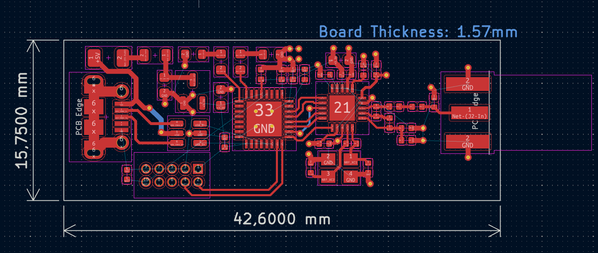
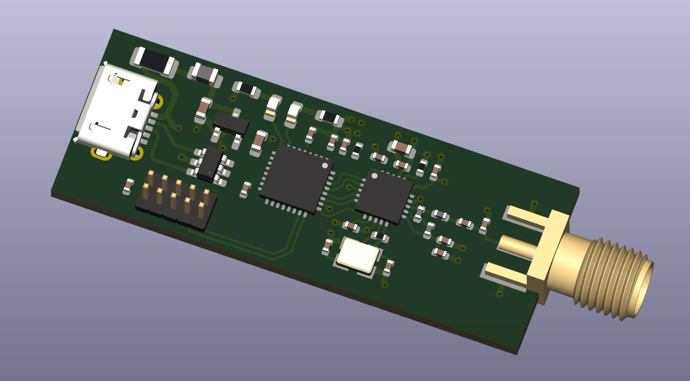

# STM32-USB-RF-POWER-BOARD

## Overview
STM32-based embedded board integrating USB, RF transceiver, and regulated power supply.
Designed in KiCad with focus on signal integrity, power distribution, EMI mitigation, and
robust hardware design practices.

The project demonstrates a complete PCB design workflow, from system architecture
definition and schematic design to PCB layout and manufacturability review.

---

## System Architecture
The board integrates the following functional blocks:

- STM32 microcontroller
- USB interface for power and data communication
- nRF24L01+ 2.4 GHz RF transceiver
- Regulated 3.3 V power supply derived from USB
- SWD interface for programming and debugging

---

## Power Architecture

The board is powered exclusively from the USB 5 V rail. Input protection is provided
by a resettable fuse (100 mA) and a ferrite bead (100 Ω @ 100 MHz) to limit overcurrent
conditions and attenuate high-frequency noise coming from the USB source.

A low-dropout linear regulator (XC6206P332MR) is used to generate the 3.3 V supply
required by the STM32 microcontroller and the RF transceiver. This regulator was
selected due to its low noise characteristics and simplicity, which are well suited
for low-current embedded applications (up to 200 mA).

Bulk capacitors are placed at both the regulator input and output to ensure stability
and reduce supply ripple. Reverse polarity protection was intentionally omitted, as the
USB connector is the only intended power source for the board.

---

## USB Design

The USB interface is implemented using a Micro-USB connector and provides both power
and data connectivity. The VBUS line is used as the sole power source for the board.

Electrostatic discharge (ESD) protection is provided by a USBLC6-2SC6 device placed
between the USB connector and the microcontroller. This device protects the D+ and D−
lines against ESD events while preserving signal integrity.

USB differential data lines are routed as a matched pair and clearly labeled to support
controlled impedance routing during PCB layout. Protection components are placed close
to the connector to minimize trace length and reduce exposure to ESD events.

---

## RF Design

The RF subsystem is based on the nRF24L01+ 2.4 GHz transceiver, interfaced with the STM32
microcontroller through an SPI interface. The device is powered from the 3.3 V rail,
with dedicated local decoupling capacitors placed close to the VDD and VDD_PA pins to
ensure stable RF operation.

Special attention was given to power integrity for the RF section by providing adequate
bulk and high-frequency decoupling and following manufacturer reference design
guidelines.

### Antenna Matching Network

The RF output is routed through a discrete impedance matching network before reaching
an SMA connector. The matching network is implemented using lumped inductors and
capacitors, allowing flexibility for tuning during bring-up or testing.

The RF trace is intended to be routed as a 50 Ω controlled-impedance transmission line.
Component placement and routing were optimized to keep the RF path as short and direct
as possible, minimizing losses and parasitic effects.

### RF Crystal Oscillator

A dedicated 16 MHz crystal oscillator is used for the RF transceiver. Load capacitors
were selected based on the required load capacitance and estimated stray capacitance
of the PCB layout. A parallel resistor is included to aid oscillator startup and
improve stability.

Crystal components are placed close to the transceiver pins with short, symmetric
traces to minimize phase noise and sensitivity to external interference.

---

## PCB Layout Strategy

The PCB layout was developed with emphasis on signal integrity, power distribution,
and noise isolation between digital, RF, and power domains. Component placement was
driven by functional grouping, minimizing critical trace lengths and optimizing return
current paths.

High-frequency and noise-sensitive components, such as the RF transceiver and its
matching network, are placed close together to reduce parasitic effects. Power-related
components are grouped to form compact current loops, reducing EMI and voltage ripple.

USB differential pairs are routed together with consistent spacing and length matching,
and ground continuity is maintained under high-speed signals to ensure a clear return
path.

A compact board outline was selected to balance mechanical constraints, routing density,
and manufacturability.

---

## Hardware Validation and Design Status

The PCB was fully designed and reviewed at schematic and layout level; however, the
board was not manufactured or assembled.

Design validation focused on schematic correctness, component selection, and layout
best practices. Electrical rules checks (ERC) and design rule checks (DRC) were used to
verify connectivity, clearance, and manufacturability constraints.

The design is considered ready for fabrication. A bring-up and validation plan was
defined, including power rail verification, SWD programming, USB enumeration, and basic
RF communication tests.

Although physical validation was not performed, the project demonstrates a complete
end-to-end PCB design workflow, from system architecture definition to layout completion.

---

## Tools
- KiCad
- STM32CubeMX (pinout and reference configuration)

---

## Project Status
- Schematic and PCB layout completed
- Design reviewed with ERC/DRC verification
- Ready for fabrication
