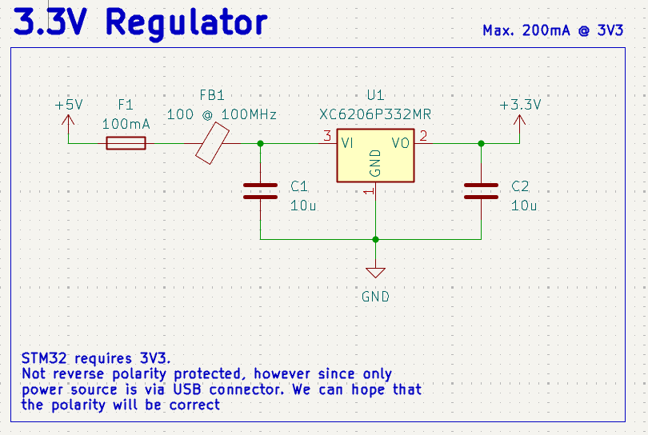
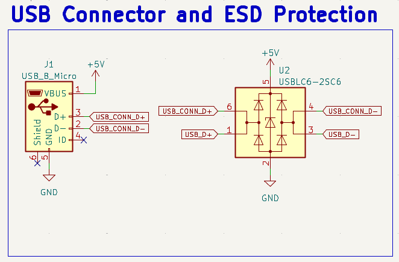
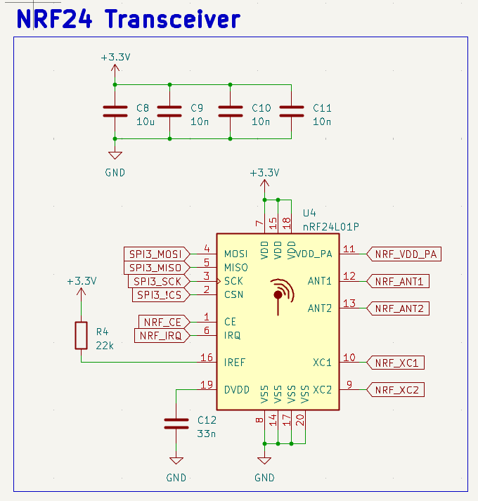
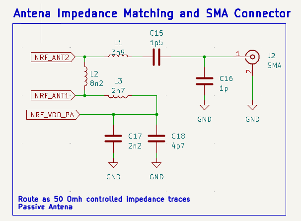
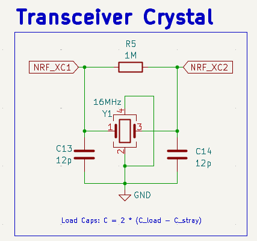

# STM32-USB-RF-POWER-BOARD

## Overview
STM32-based embedded board integrating USB, RF transceiver, and regulated power supply.
Designed in KiCad with focus on signal integrity, power distribution, EMI mitigation, and hardware validation.

## System Architecture
- STM32 microcontroller
- USB interface with ESD protection
- RF transceiver with matching network
- Buck and LDO-based power regulation
- SWD and UART debug interfaces
  
## Power Architecture

The board is powered exclusively from the USB 5 V rail. Input protection is provided
by a resettable fuse (100 mA) and a ferrite bead (100 Ω @ 100 MHz) to limit overcurrent
conditions and attenuate high-frequency noise coming from the USB source.

A low-dropout linear regulator (XC6206P332MR) is used to generate the 3.3 V supply
required by the STM32 microcontroller and the RF transceiver. This regulator was
selected due to its low noise characteristics and simplicity, which are well suited
for low-current embedded applications (up to 200 mA).

Bulk capacitors are placed at both the regulator input and output to ensure stability
and reduce supply ripple. Reverse polarity protection was intentionally omitted, as the
USB connector is the only intended power source for the board.

## USB Design

The USB interface is implemented using a Micro-USB connector and is intended to provide
both power and data connectivity. The VBUS line is used exclusively as the main power
source for the board.

Electrostatic discharge (ESD) protection is provided by a USBLC6-2SC6 device placed
between the USB connector and the microcontroller. This device protects the D+ and D−
lines against ESD events while preserving signal integrity.

The USB differential data lines (D+ and D−) are routed as a matched differential pair
and are clearly labeled to support controlled impedance routing during PCB layout.
Protection components are placed close to the connector to minimize trace length and
reduce exposure to ESD events.

This design follows common USB layout recommendations to ensure reliable communication
and robust operation during connection and disconnection events.

## RF Design

The RF subsystem is based on the nRF24L01+ 2.4 GHz transceiver, interfaced with the
STM32 microcontroller through an SPI interface. The device is powered from the 3.3 V
rail, with dedicated local decoupling capacitors placed close to the VDD and VDD_PA
pins to minimize supply noise and ensure stable RF operation.

Special attention was given to power integrity for the RF section by separating the
PA supply domain and providing adequate bulk and high-frequency decoupling, following
the manufacturer’s reference design guidelines.

### Antenna Matching Network

The RF output is routed through a discrete impedance matching network before reaching
an SMA connector. The matching network is implemented using lumped inductors and
capacitors, allowing flexibility for tuning during bring-up or testing.

The RF trace is intended to be routed as a 50 Ω controlled-impedance transmission line.
Component placement and routing were optimized to keep the RF path as short and direct
as possible, reducing losses and minimizing parasitic effects.

### RF Crystal Oscillator

A dedicated 16 MHz crystal oscillator is used for the nRF24L01+ transceiver. The crystal
load capacitors were selected based on the required load capacitance and estimated
stray capacitance of the PCB layout. A parallel resistor is included to aid oscillator
startup and improve stability.

Crystal components are placed close to the transceiver pins, with short and symmetric
traces to minimize phase noise and sensitivity to external interference.

## PCB Layout Strategy
(To be documented)

## Hardware Validation
(To be documented)

## Tools
- KiCad
- STM32CubeMX (pinout reference)

## Project Status
- PCB designed
- PCB manufactured and assembled
- Hardware bring-up and validation completed
